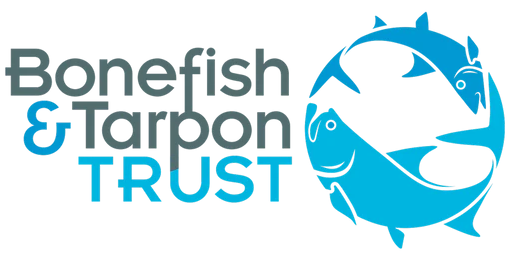

::: {.hero}
# Best Catch Assessment (BECCA) Learning Hub

A practical learning resource for turning fisher knowledge into quantitative information for data-poor fisheries.

BECCA was developed by **Project Seagrass** in collaboration with **Florida International University**, with funding and support from the **Bonefish & Tarpon Trust**.
:::

## Start here

The **Best Catch Assessment (BECCA)** is a standardised method for collecting quantitative information from fishers, harvesters, guides, gleaners, divers, and other local knowledge holders. It asks people to recall their best fishing or harvesting experiences, record the **number**, the **year**, and the **effort**, and then uses these responses to reconstruct patterns of catch, encounter rates, size, and change through time.

This site turns the BECCA Handbook into a modular learning resource. It is designed for local communities, fishing organisations, Indigenous and local knowledge holders, NGOs, government partners, researchers, and practitioners working in data-poor fisheries.

## What you can do here

- Learn what BECCA is and when to use it.
- Understand the core rule: **number + year + effort**.
- Choose the right metric for different fisheries.
- Design a BECCA survey for recreational, small-scale, gleaning, trap, net, fish fence, or invertebrate fisheries.
- Download the handbook and questionnaire templates.
- Learn how to store BECCA data for future analysis.

::: {.callout-tip}
## New to BECCA?
Start with [BECCA at a glance](at-a-glance.qmd), then work through the learning modules in order.
:::

## Suggested learning pathway

1. [What is BECCA?](modules/01-what-is-becca.qmd)
2. [Why BECCA was developed](modules/02-why-becca-was-developed.qmd)
3. [Why best catches?](modules/03-why-best-catches.qmd)
4. [Core principles](modules/04-core-principles.qmd)
5. [Wisdom of Crowds](modules/05-wisdom-of-crowds.qmd)
6. [Choosing metrics](modules/06-choosing-metrics.qmd)
7. [Using the questionnaire](questionnaire.qmd)
8. [Data storage](modules/11-data-storage.qmd)

## Handbook Citation

Jones, B.L.H. (2026). *Best Catch Assessment (BECCA) Handbook: A practical guide for turning fisher knowledge into quantitative information for data-poor fisheries*. Project Seagrass, UK.

::: {.partner-strip}
::: {.partner-block}
**In collaboration with:**

{.partner-logo}
:::

::: {.partner-divider}
:::

::: {.partner-block}
**Funded by:**

{.partner-logo}
:::
:::
